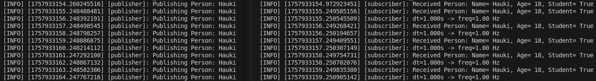
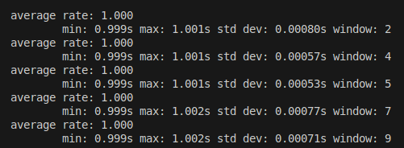
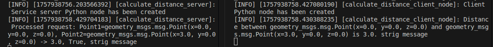
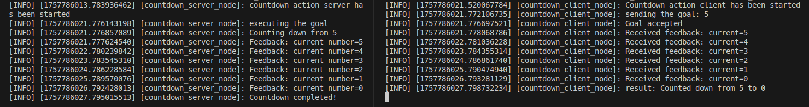
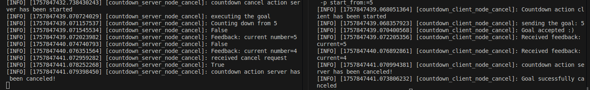
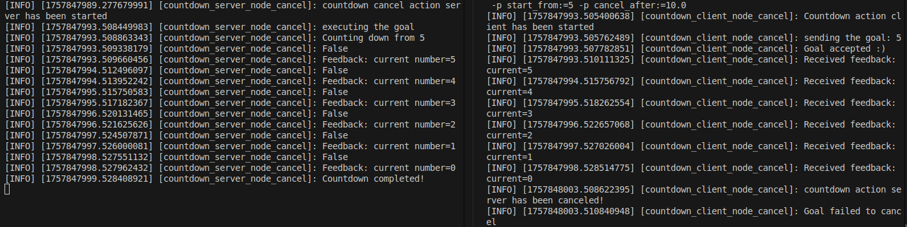
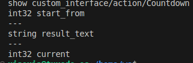
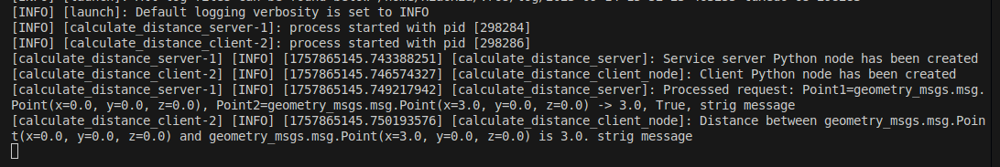

## Task 1 - Topics
___

### Tasks done

- Used the provided publisher/subscriber code examples as a starting point
- Edited message formats to `PoseStamped`
- Added `pose.position` iteration
- Ran commands below:

Terminal 1:
```
colcon build
source install/setup.bash

ros2 run pose_package publisher
```
Terminal 2:
```
source install/setup.bash

ros2 run pose_package subscriber
```

Terminal 3:
```
source install/setup.bash

ros2 topic list
ros2 topic echo Pose
ros2 topic hz Pose
ros2 topic info /Pose
```

### Results

- The `list` showed the /Pose
	- 

- The `echo` showed the header and the pose updating
	- 

- The `hz` showed the average rate of 1.000 with slight changes between the min and the max
	- 

- The `info` showed the type of `PoseStamped` and 1 publisher and 1 subscription
	- 

	- The `info` didn't seem to work without the `/` -symbol like the other commands did


### OPTIONAL 1:
- Explain what would be the QoS parameters for critical data in the system?
	- Reliability Policy: For critical data, choose Reliable to guaranteed delivery.
	- Durability Policy: Choose Transient local so that a new subscriber can still receive the stored messages.
 	- History Policy: If we need to store everything, we use Keep All. But in real life, such as for high-rate sensors, it’s better to use Keep Last with a large enough depth. Since the buffer is limited, and the latest data is more important.
  	- depth: A large enough depth.

- What about live data?
	- Reliability Policy: Choose Best effort since the latest messages are important, and old data can be lost.
	- Durability Policy: Choose Volatile since the latest messages matter.
	- History Policy: Choose Keep Last to store only a small number of recent messages.
	- depth: A small number, sometimes 1 is enough.

- What type of data would it make sense to use Transient Local with?

Transient Local ensures that when a new subscriber connects, it will receive a history of stored messages. This is useful for relatively static or big-picture information, such as maps or system and robot configuration. It is important for every node, and even if a node joins late, it can still get this information.


## Task 2 - Custom messaging
___

### Tasks done

- Created the C++ `custom_interface` package and the format according to the guide
- Created a new ROS2 Python package `custom_pinterface` with:
```
ros2 pkg create --build-type ament_python custom_pinterface --license Apache-2.0 --dependencies rclpy std_msgs geometry_msgs
```
- Used the provided publisher/subscriber code examples as a starting point
- Changed msg type and formatting
- Added dependencies
- Ran commands below:

Terminal 1
```
colcon build
sb

ros2 run custom_pinterface publisher
```

Terminal 2
```
sb

ros2 run custom_pinterface subscriber
```
### Results

- The publisher and subscriber successfully send and receive the Person messages


### OPTIONAL 2: add a Header message to the Person.msg
#### Tasks done
- Added `std_msgs/Header header` on the top of `custom_interface/msg/Person.msg`
- Added the following to the publisher file
```
msg.header.stamp = self.get_clock().now().to_msg()
msg.header.frame_id = "map"
```
- In the subscriber file, get the publisher time `current_time = Time.from_msg(msg.header.stamp)` and calculate the time span and frequence
- Ran commands below:

Terminal 1
```
colcon build
sb

ros2 run custom_pinterface publisher
```

Terminal 2
```
sb

ros2 run custom_pinterface subscriber
```

Terminal 3
```
sb

ros2 topic hz /PersonTopic
```


#### Results
In the publisher file, timer_period = 1, and we can see from the result that frequency is 1




## Task 3 - Services
___

### Tasks done

- Created new package `service_example` according to the guide
- Created `CalculateDistance.srv` service to `custom_interface` package
- Created server and client nodes to the new package
- Added dependencies (e.g `geometry_msgs` and `builtin_interfaces` in `CMakeLists.txt`) and entry points
- Ran commands below:

Terminal 1
```
colcon build
sb

ros2 interface show custom_interface/srv/CalculateDistance

ros2 run service_example calculate_distance_server 
```

Terminal 2
```
sb

ros2 run service_example calculate_distance_client
```

### Results

- The server and the client successfully communicate with each other with client receiving the calculated distance


- The custom service


## Task 4 - Parameters
___

### Tasks done

- Added parameter deceleration for points as lists to `calculate_distance_client.py`
- Added parameter gets to the old point variables
- Added the node and the parameters to the `params.yaml` file which was created according to the guide
- Ran commands below:

Terminal 1
```
colcon build
sb

ros2 run service_example calculate_distance_server
```

Terminal 2
```
sb

ros2 run service_example calculate_distance_client --ros-args --params-file src/service_example/config/params.yaml
```

### Results

- The server and the client successfully communicate with each other with client receiving the calculated distance based on the yaml file
<!---->


- This was ran with different values in the yaml file to confirm it's indeed reacting to changes


## Task 5 - Actions
___

### Tasks done
- Created a file `Countdown.action` in the package custom_inteface/action with the given format, and modify the CMakeLists.txt
- Created a package called countdown, `ros2 pkg create --build-type ament_python countdown --dependencies rclpy custom_interface`
- Created countdown_server.py and countdown_client.py, add code based on the fibonacci examples
- Created countdown_server_cancel.py and countdown_client_cancel.py for the cancellation based on the examples
- Ran commands below:

**server-client pair**

Terminal 1
```
colcon build
sb

ros2 run countdown countdown_server
```


Terminal 2
```
sb

ros2 run countdown countdown_client --ros-args -p start_from:=5
```

**server-client pair that handles the cancellation**

Terminal 1
```
colcon build
sb

ros2 run countdown countdown_server_cancel 
```


Terminal 2
```
sb

ros2 run countdown countdown_client_cancel --ros-args -p start_from:=5

ros2 run countdown countdown_client_cancel --ros-args -p start_from:=5 -p cancel_after:=10.0

```


### Results

**server-client pair**
- The server and the client successfully communicate with each other with client send 5 and count down from it


**server-client pair that handles the cancellation (default cancel_after value is 2.0 seconds)**

- It cancelled since it need more time to countdown from 5 to 0.


- If we set the cancel_after value to 10.0 seconds, the countdown was finished, and the cancel was failed.



- The custom action.


  
## Task 6 - Launch Files
___

### Tasks done
- Created a package called ws_bringup
- Modified the `setup.py` and `package.xml` file
- Created the launch file `task3.launch.py` based on the example
- Ran commands below:
```
colcon build
sb

ros2 launch ws_bringup task3.launch.py 
```

### Results

In the params.yaml, point1: [ 0.0, 0.0 ], point2: [ 3.0, 0.0 ].


### Optional 3: Add support for separate terminals
#### Tasks done
- Added parameter launch argument option for opening in separate terminals to `task3.launch.py`
- Added conditions and Exectue processes for opening in separate terminals

Used by specifying launch argument `use_terminals:=1`:
```
colcon build
sb

ros2 launch ws_bringup task3.launch.py use_terminals:=1
```

