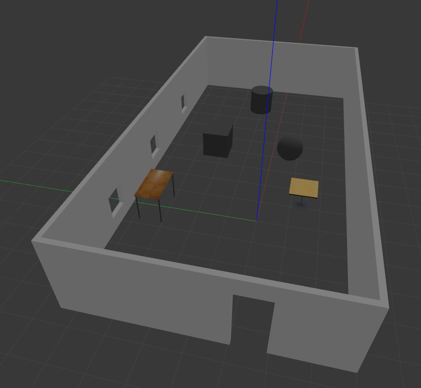
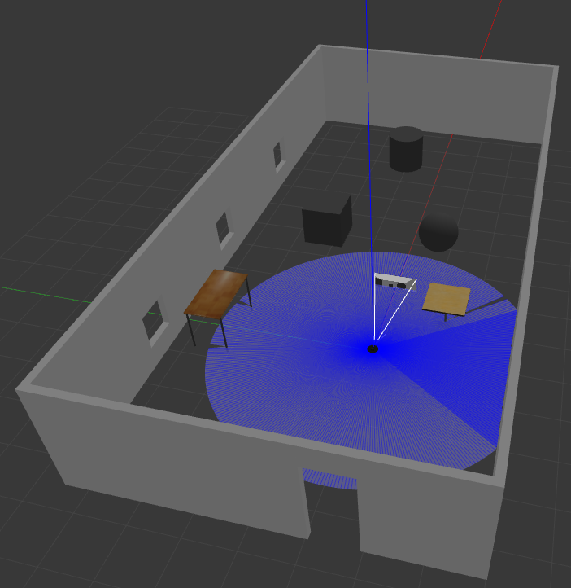
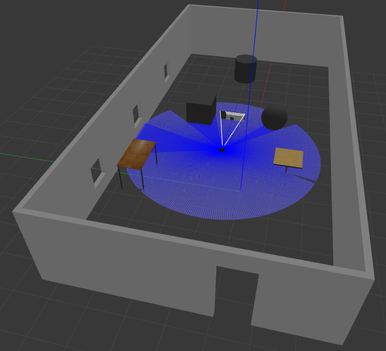
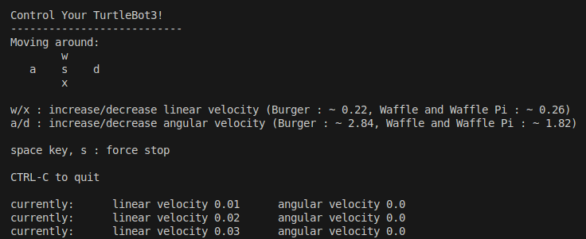
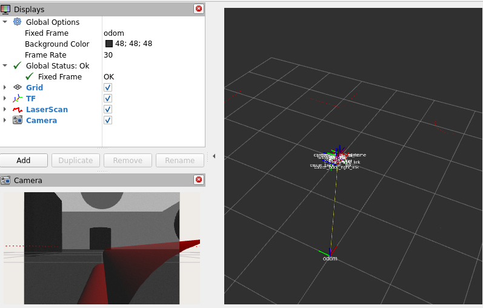
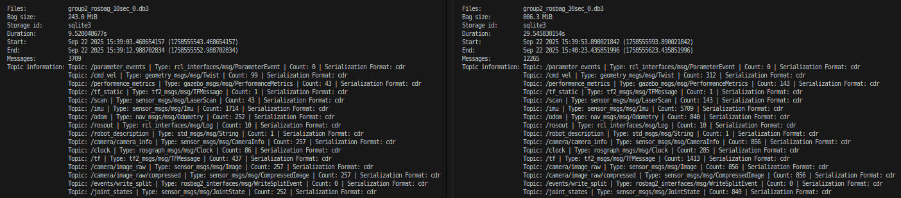

## Task 1 - rqt_graph
- [x] Installed required packages
- [x] Ran commands below in the workspace:

Terminal 1:
```
source /opt/ros/humble/setup.bash

ros2 run turtlesim turtlesim_node
```
Terminal 2:
```
source /opt/ros/humble/setup.bash

ros2 run turtlesim turtle_teleop_key
```
Terminal 3:
```
source /opt/ros/humble/setup.bash

ros2 run rqt_graph rqt_graph
```

- [x] In *rqt_graph*, change view to *Node/Topics*
  - The *Node/Topics* -view shows a more comprehensive view of the topic, highlighting its inheritance.
  - 
  - `/teleop_turtle` is publishing the move commands to the `/turtle1/cmd_vel` topic, which `/turtlesim` subscribes to. To get the absolute rotations right, the turtle gives feedback and results back to the `/teleop_turtle` with action topics.

- [x] Open the *Topic Monitor* plugin from `rqt`
  - `/turtle1/cmd_vel` is responsible for moving the turtlebot. From the *Topic Monitor*, we can see that the message is `geometry_msgs/msgs/Twist` with linear and angular double vectors.
  - 

- [x] Open the *Plot* plugin from `rqt`
- [x] Add `/turtle1/pose/x` and `/turtle1/pose/y` to the plot
- [x] Move the turtlebot from `turtle_teleop_key` node
  - The position gets plotted
  - 


## Task 2 - rviz
- [x] Previous example
- [x] In *rviz* select `base_link` for fixed frame
- [x] Add *Odometry*, *LaserScan*, *Camera* and *TF* and play with their parameters.
  - The *Odometry* shows an arrow on the robot. When the fixed frame is set to `odom`, it spawns multiple arrows that mark the robot's path. The visualisation can be easily configured, e.g. the frequency, amount and size.
  - The *LaserScan* shows a visualisation of the lidar sensor as shapes whose properties can be adjusted, e.g. the delay, size, shape and color.
  - The *TF* shows the transformations of the robot's frames (mainly the different parts of the robot). There, you can, for example, toggle some parts off and show their names to make the visualisation clearer.
  - The *Camera* gives a first-person view of the robot's camera with a few basic view settings.
- [x] Move the robot around the map with the `ros2 run turtlebot3_teleop teleop_keyboard` in another terminal.
  - First, this command gave an error about the model, but after exporting the model (and sourcing ROS) again according to the guide, it worked.
  - 
  - 
- [x] Changed parameters:
  - The *Covariance* had to be turned off on the *Odometry* so it doesn't block the view.
  - The fixed frame had to be set from `base_link` to `odom` for visualising the path of the robot.
- [x] Difference with *burger* and *waffle_pi*:
  - The *burger* did not seem to have a camera signal, but *waffle_pi* had it. Otherwise, the other visualisations and controls seemed to work similarly on both of them.
  - 

## Task 3 - TF2
- [x] Previous example. And after sourcing, run `ros2 run tutorial_pkg tf_broadcaster` on the background. Also, the run commands below are running simultaneously on different terminals.
- [x] Create a new package with `ros2 pkg create --build-type ament_python task3_pkg`
- [x] Static transformation script: *tf_static_broadcaster.py*
  - [x] Use the broadcaster example from the guide as a starting point and modify the code for a static transform
  - [x] Set static transform value to x and z
  - [x] After sourcing, run with `ros2 run task3_pkg tf_static_broadcaster`
  - (Verification in the final picture)
- [x] Dynamic scanner broadcaster script: *tf_broadcast_scanner.py*
  - [x] Use the broadcaster example from the guide as a starting point
  - [x] Set oscillation frequency
  - [x] Set the oscillation movement using a sin wave (and convert the oscillation to angular) `math.sin(2 * math.pi * self.frequency * t)`
  - [x] After sourcing, run with `ros2 run task3_pkg tf_broadcast_scanner`
  - (Verification in the final picture)
- [x] Listener for transforms: *tf_listener_transform*
  - [x] Use the listener example from the guide as a starting point
  - [x] Track last position and time
  - [x] Calculate distance with `math.sqrt(x**2 + y**2 + z**2)`
  - [x] Get delta distance and time and calculate speed with delta distance / delta time
  - [x] After sourcing, run with `ros2 run task3_pkg tf_listener_transform`
  - 
- [x] Listener for revolutions: *tf_listener_revolutions*
  - [x] Track last yaw and revolutions
  - [x] Get the delta of yaw and take into account it going around
  - [x] Calculate total yaw and revolutions from that
  - [x] After sourcing, run with `ros2 run task3_pkg tf_listener_transform`
  - It only notifies on new revolutions, so you have to wait for  a revolution to pass for logs
  - 

- Result of `ros2 run rqt_tf_tree rqt_tf_tree`:
  - 

- Rviz2 verification:
  -  (it spins and the scanner oscillates)

## Task 4 - Gazebo
- [x] Used the tutorial example as a basis
  - [x] Created `gazebo_example` package by running `ros2 pkg create --build-type ament_python gazebo_example --license Apache-2.0 --dependencies launch launch_ros gazebo_ros`
  - [x] Created a `launch` folder and a `worlds` folder
  - [x] Modified `setup.py` and `package.xml`
- [x] Used Gazebo Building Editor to create a world `lab2_task4.world` and placed it in the `worlds` folder
- [x] Added and adapted the example launch file `gazebo_example.launch.py` in the `launch` folder
- [x] Saved the rviz configuration as `lab2task4.rviz`
- [x] Ran commands below in the workspace:

First in every Terminal:
```
source /usr/share/gazebo/setup.sh
source /opt/ros/humble/setup.bash

export TURTLEBOT3_MODEL=waffle_pi
export GAZEBO_MODEL_PATH=$GAZEBO_MODEL_PATH:/opt/ros/humble/share/turtlebot3_gazebo/models
```

After `colcon build --packages-select gazebo_example`

Terminal 1 (Spawn robot in default positions):
```
source install/setup.bash
ros2 launch gazebo_example gazebo_example.launch.py use_sim_time:=true
```



Or Terminal 1 (Spawn robot in positions x_pose:=2.0 y_pose:=1.0):

```
ros2 launch gazebo_example gazebo_example.launch.py use_sim_time:=true x_pose:=2.0 y_pose:=1.0
```


Terminal 2:
```
source install/setup.bash
ros2 run turtlebot3_teleop teleop_keyboard
```


Terminal 3 (Launch the saved rviz):
```
source install/setup.bash
ros2 run rviz2 rviz2 -d lab2task4.rviz
```


## Task 5 - Rosbags
- [x] Ran commands below in the workspace:

Terminal 1:
```
ros2 launch gazebo_example gazebo_example.launch.py
```

Terminal 2:
```
ros2 run turtlebot3_teleop teleop_keyboard
```

Terminal 3:
```
timeout 10s ros2 bag record -a -o group2_rosbag_10sec
timeout 30s ros2 bag record -a -o group2_rosbag_30sec

```

- [x] Ran `ros2 bag info /home/ws/group2_rosbag_10sec` and `ros2 bag info /home/ws/group2_rosbag_30sec`




From the result: 
- group2_rosbag_10sec (around  9.52 s,  3709 messages, 243.0 MiB)
- group2_rosbag_30sec (around 29.55 s, 12265 messages, 806.3 MiB)

The 30-second rosbag is about 3.1 times longer, and both the message count and bag size are about 3.3 times larger. This makes sense since most topics publish at approximately fixed rates, so the total messages and bag size scale roughly with duration.


